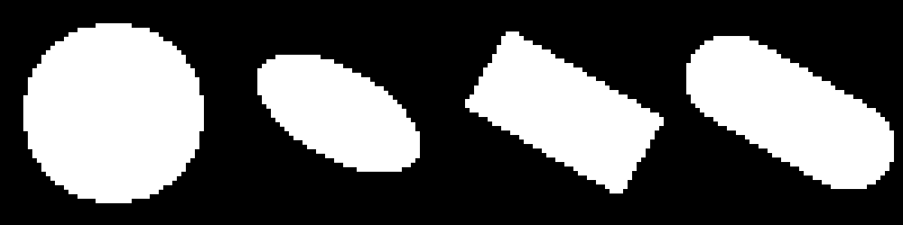
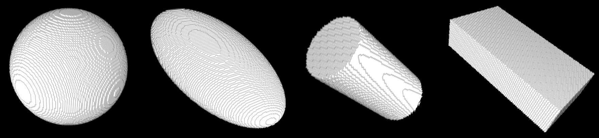

# Digital Shapes

A library for ImageJ/Fiji that allows to generate binary images representing discretized 
common shapes: ellipses, boxes, ellipsoids...
The generated images can be used to validate image processing algorithms,
or for modelling purpose by combining several shapes together.

Examples of 2D digitized shapes:

It is also possible to generate discretized version of 3D shapes (balls, ellipsoids, cylinders...):

## Dependencies:
* ImageJ
* JUnit
* [ijGeometry](https://github.com/ijtools/ijGeometry), a geometry library for ImageJ

## Installation

To install the "Digital Shapes" library, follow these steps:
* copy the latest version of the "ijGeometry" library into the "jars" directory the ImageJ/Fiji installation
* copyt the latest version of the "Digital_Shapes" library into the "plugins" directory
* restart ImageJ
  
A new "Digital Shapes" Menu should now appear within the "plugins" menu.
